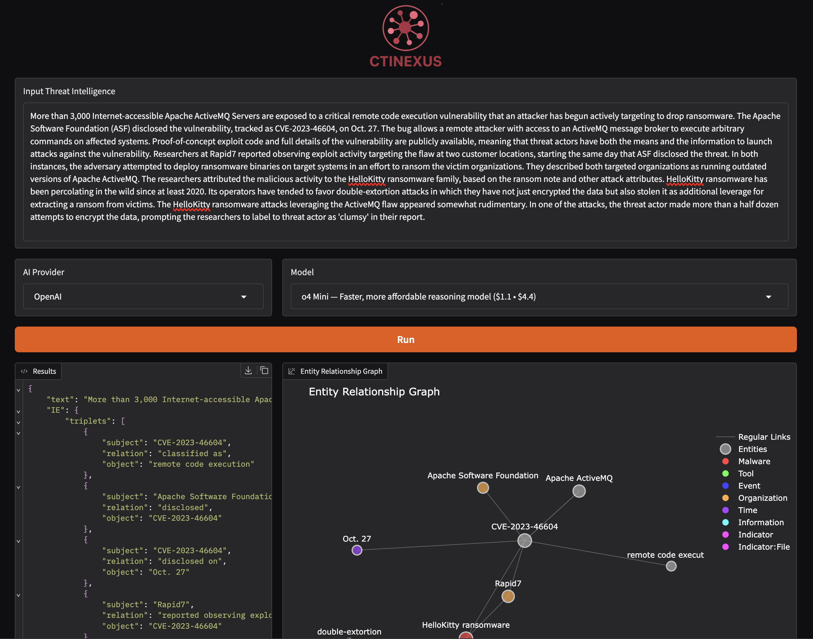

<!-- # <p align=center>`CTINEXUS: Automatic Cyber Threat Intelligence Knowledge Graph Construction Using Large Language Models`</p>omit in toc -->
<div align="center">
  
  <h1 align="center">Automatic Cyber Threat Intelligence Knowledge Graph Construction Using Large Language Models</h1>
</div>

<p align="center">
  <a href='https://github.com/peng-gao-lab/CTINexus'></a>
  <a href='https://arxiv.org/abs/2410.21060'></a>  
  <a href='https://ctinexus.github.io/' target='_blank'></a>
</p>

This is a fork of the [CTINexus demo](https://github.com/peng-gao-lab/CTINexus/) which converts it into a containerized micro-service as a proof-of-concept use case, allowing the user to submit text and return the processed framework results along with a visualization of the graph.  It uses [Gradio](https://www.gradio.app/) for the UI.  Please see their project [here](https://ctinexus.github.io/).
<p align="center">
  
</p>


The repository of **CTINexus**, a novel framework leveraging optimized in-context learning (ICL) of large language models (LLMs) for data-efficient CTI knowledge extraction and high-quality cybersecurity knowledge graph (CSKG) construction. CTINexus requires neither extensive data nor parameter tuning and can adapt to various ontologies with minimal annotated examples.
<p align="center">
  
</p>


## Introduction
CTINexus composes of the following modules: 
* [IE](IE): A carefully designed automatic prompt construction strategy with optimal demonstration retrieval for extracting a wide range of cybersecurity entities and relations;
* A hierarchical entity alignment technique that canonicalizes the extracted knowledge and removes redundancy; 
   * [ET](ET): Groups mentions of the same type.
   * [EM](EM): Merges mentions referring to the same entity with IOC protection.
* [LP](LP): An long-distance relation prediction technique to further complete the CSKG with missing links.


## Citation
```
@inproceedings{cheng2025ctinexusautomaticcyberthreat,
      title={CTINexus: Automatic Cyber Threat Intelligence Knowledge Graph Construction Using Large Language Models}, 
      author={Yutong Cheng and Osama Bajaber and Saimon Amanuel Tsegai and Dawn Song and Peng Gao},
      booktitle={2025 IEEE European Symposium on Security and Privacy (EuroS\&P)},
      year={2025},
      organization={IEEE}
}
```